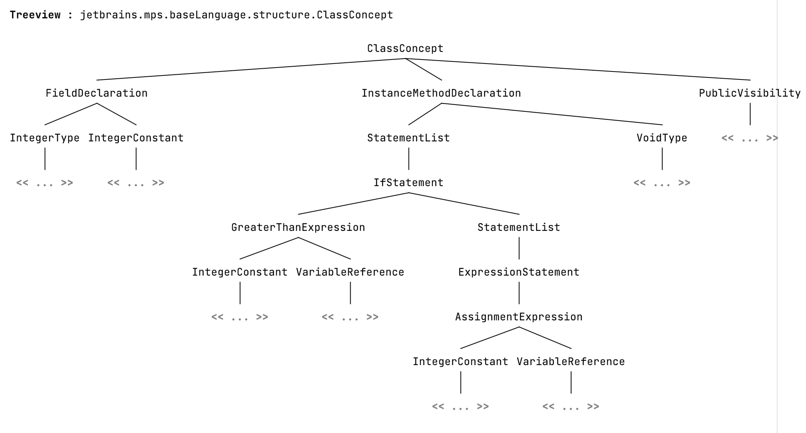
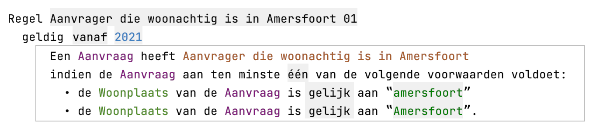
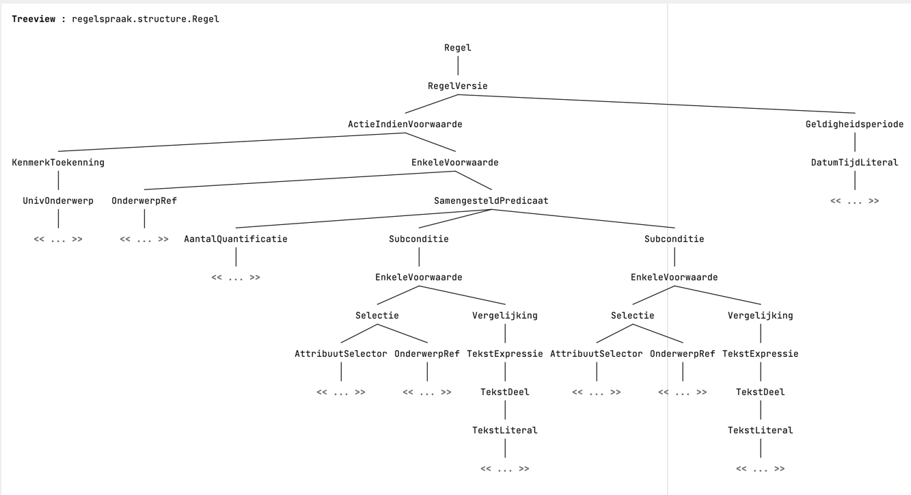

#Concept tree view 

created with Jetbrains MPS 2021.2

The menu item is located in the View menu.It produces views like:

This functionality is made for explaining the syntax of RegelSpraak rules, like this one:

The concept tree which belongs to the rule above is shown below:

